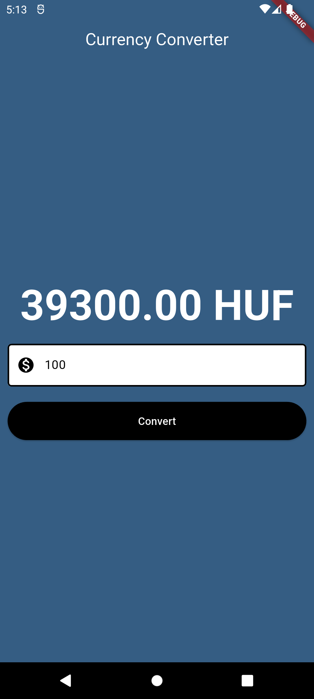

# Currency Converter App

A simple currency converter application built with Flutter. The app allows users to convert USD to HUF using Material and Cupertino (iOS-style) designs.

## Features

- Material Design (Android-style) and Cupertino (iOS-style) UI support
- USD to HUF currency conversion
- Simple and easy-to-use interface

## Installation

To run the project locally:

1. Clone the repository:

    ```bash
    git clone https://github.com/your-username/currency-converter-app.git
    ```

2. Navigate to the project directory:

    ```bash
    cd currency-converter-app
    ```

3. Install the dependencies:

    ```bash
    flutter pub get
    ```

4. Run the app:

    ```bash
    flutter run
    ```

## Usage

Once the app is launched, users can input an amount in USD and tap the "Convert" button to see the result in HUF.

## Screenshot

Below is a screenshot of the app in action:

